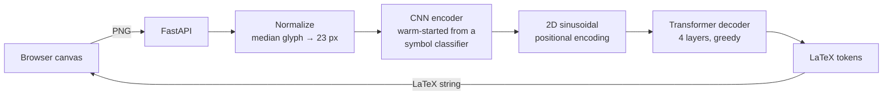

# LaTeXVision

Handwritten math to LaTeX. You write an expression on a browser canvas, and
an image-to-LaTeX transformer reads it straight from the pixels. It handles
superscripts, subscripts, nested scripts and fractions.

On 165 held-out expressions written by real people, **51% come back as
exactly the right LaTeX**. On the full 1,665-expression test set the figure
is **59%**, and **89%** on flat expressions. See [Results](#results).

## How it works



1. **Normalize.** The canvas image is cropped to its ink and rescaled so the
   median glyph is 23 px tall. This is the size the encoder was pretrained
   on, whatever size the user wrote at. Training, evaluation and serving all
   share this one code path (`src/data/expression_images.py`).
2. **Encode.** A small CNN turns the image into a grid of 128-channel
   features at 1/4 resolution. The CNN is the conv trunk of a symbol
   classifier trained first on isolated handwritten symbols, so it starts
   out already able to see digits, letters and operators.
3. **Decode.** A 1×1 conv projects the features to 256 dimensions, and a 2D
   sinusoidal positional encoding tells the decoder where each feature sits:
   row and column are encoded separately, so "above" and "to the right of"
   are distinguishable. A transformer decoder then attends over the grid and
   emits LaTeX one token at a time.

## Results

These are scores on the test split, which was used only for this
evaluation. Exact match means the whole canonical token sequence is correct.
Brackets give 95% bootstrap confidence intervals. The full report is in
[`experiments/expression_benchmark/im2latex_v1/report.md`](experiments/expression_benchmark/im2latex_v1/report.md).

| Test set | n | Exact match | Structure match | Token edit rate |
|---|---:|---:|---:|---:|
| **All test expressions** | 1665 | **59.4%** [57–62] | 70.2% | 0.081 |
| **Human handwriting** (MathWriting + CROHME) | 165 | **50.9%** [44–58] | 62.4% | 0.205 |
| Synthetic (HASYv2 glyphs) | 1500 | 60.3% [58–63] | 71.1% | 0.068 |
| MathWriting (human) | 67 | 53.7% [42–66] | 64.2% | 0.217 |
| CROHME 2014 test set | 98 | 49.0% [39–59] | 61.2% | 0.196 |

| By structure | All sources (n) | Exact | Human only (n) | Exact |
|---|---:|---:|---:|---:|
| Flat (`3x+2<y`) | 421 | 88.6% | 46 | 63.0% |
| Single-level scripts (`x^{12}+a_{1}`) | 423 | 54.8% | 48 | 45.8% |
| Nested scripts (`x^{y^{2}}`) | 384 | 33.9% | 9 | 11.1% |
| Fractions (`\frac{a+1}{b}`) | 437 | 58.1% | 62 | 51.6% |

Median CPU latency is **41 ms** per expression at batch size 1.

**How to read these numbers:**
- **Human handwriting is the honest headline.** 1,500 of the 1,665 test
  expressions are synthetic. They are built from real handwritten glyphs,
  but by the same generator as the synthetic training data. The 165
  human-written expressions (MathWriting's test split and the standard
  CROHME 2014 test set) are the better estimate of real-world accuracy.
- **The human test set is small.** Its confidence intervals run roughly ±7
  to ±12 points. Nested scripts in human writing have only 9 examples, so
  the 11% there is close to anecdotal.
- **Nested scripts are the weakest structure.** They are the rarest
  structure in the human training data.
- **Structure match** checks whether the layout was right, with every symbol
  replaced by a placeholder. The gap between it and exact match (about 11
  points) is the share of expressions where the layout was right but a
  symbol was misread.

Errors on the full test set:

| Missing symbols | Extra symbols | Wrong symbols | Wrong structure |
|---:|---:|---:|---:|
| 145 | 252 | 237 | 42 |

## Quick start

```bash
python -m venv .venv && source .venv/bin/activate
pip install -r requirements.txt
```

No datasets or trained weights are committed; see the licenses under
[Data](#data). The full pipeline, from nothing to a served model, is:

```bash
# 1. Encoder pretraining: symbol classifier on HASYv2 (download below)
python -m src.training.train_classifier

# 2. Expression data: stream-filter MathWriting, then build the combined dataset
python -m src.data.mathwriting --archive data/raw/mathwriting/mathwriting-2024.tgz
python -m src.data.build_expression_dataset

# 3. Train the transformer (30 epochs at about 13 min each on an Apple M5)
python -m src.training.train_im2latex
python -m src.training.train_im2latex --resume          # continue an interrupted run

# 4. Evaluate on the test split and render the report
python -m src.evaluation.expression_benchmark
python -m src.evaluation.benchmark_report \
    --summary experiments/expression_benchmark/im2latex_v1/test_summary.json

# 5. Serve
uvicorn src.api.main:app --port 8000
```

Then open `http://127.0.0.1:8000/expression.html`. Open the served URL, not
the HTML file from disk: the page calls the API with relative paths.

## Vocabulary and tokenizer

The tokenizer (`src/data/latex_tokenizer.py`) is LaTeX-aware, not
character-level: `\frac`, `\times` and `\infty` are single tokens. The
vocabulary is deliberately small, 33 tokens in all:

| Group | Tokens |
|---|---|
| Digits | `0`–`9` |
| Variables | `a b c x y z` |
| Operators | `+ - \times < >` |
| Brackets | `[ ]` |
| Other | `\infty` |
| Structural | `^ _ { } \frac` |
| Special | `<pad> <bos> <eos> <unk>` |

The 24 symbols are exactly the classes the encoder was pretrained on. `√`
is the only pretraining class left out, because square roots are out of
scope. `=`, `(` and `)` don't appear in the pretraining data at all (see
[Data](#data)).

**Canonicalization** matters as much as tokenization. The three data sources
write the same expression differently, so every label and every model
output goes through `canonicalize` before training or comparison:
- `x^2` and `x^{2}` become the same thing: script and fraction arguments
  are always braced.
- Plain grouping braces are removed.
- `x_{1}^{2}` and `x^{2}_{1}` are ordered the same way, with `^` first.
- Synonyms are mapped: `\lt`→`<`, `\gt`→`>`, `\dfrac`→`\frac`.
- Presentation-only commands are dropped: `\left`, `\right`, `\mbox`,
  `\mathrm`, `$` and spacing commands.

That way a match is a match, whichever source's conventions wrote the
label.

## Data

Three sources, all filtered to expressions that fit the vocabulary, go into
one manifest (`data/processed/expressions/manifest.jsonl`):

| Source | Train | Val | Test | License |
|---|---:|---:|---:|---|
| **Synthetic**, real HASYv2 glyphs composed by a grammar | 30,000 | 1,500 | 1,500 | [ODbL 1.0](https://opendatacommons.org/licenses/odbl/1-0/) (HASYv2) |
| **[MathWriting](https://arxiv.org/abs/2404.10690)** (Google, 2024), human + synthetic ink | 19,080 | 109 | 67 | CC BY-NC-SA 4.0 |
| **[CROHME](https://www.cs.rit.edu/~crohme2019/)** 2012–2014, human ink | 877 | — | 98 | research use only; not redistributable |
| **Total** | **49,957** | **1,609** | **1,665** | |

**Synthetic expressions** (`src/data/synthetic_expressions.py`,
`configs/synthetic_expressions.yaml`):
- A grammar builds expression trees (rows, glyphs, scripts, fractions and
  bracketed groups), and a box-layout renderer places real HASYv2 glyphs to
  match.
- The four structure types are sampled in exact equal counts (flat, single
  scripts, nested scripts, fractions) using a shuffled schedule.
- Layout jitter is deliberately wide: glyph gaps, vertical wobble, script
  size (0.6–0.8×) and position, fraction-bar overhang. The model has to
  learn structure, not fixed offsets.
- Superscripts and subscripts on the same base are kept from colliding.
- Glyphs for each split come only from the same split of the encoder's
  pretraining data, so no synthetic test expression contains a glyph the
  encoder saw during pretraining.

**MathWriting** (`src/data/mathwriting.py`): the 3.1 GB archive holds about
650k tiny InkML files. The loader streams the `.tgz` and writes only the
expressions that fit. It kept 6,796 of 229,864 human training expressions
and 12,284 of 396,014 synthetic ones. MathWriting's own train, valid and
test splits are kept (they separate both writers and expressions).

```bash
mkdir -p data/raw/mathwriting
curl -L https://storage.googleapis.com/mathwriting_data/mathwriting-2024.tgz \
  -o data/raw/mathwriting/mathwriting-2024.tgz
```

**CROHME** comes from the CROHME 2019 package (Task 1, online formula
recognition).
- The 2014 test set (the standard benchmark split in the literature) is used
  only for testing.
- `Train_2014` plus the 2012 and 2013 test sets are used for training.
- Labels are the InkML `truth` annotations, with the `$…$` wrapper
  stripped.

```bash
mkdir -p data/raw/crohme2019 && cd data/raw/crohme2019
curl -LO https://www.cs.rit.edu/~crohme2019/downloads/Task1_and_Task2.zip
unzip -q Task1_and_Task2.zip "Task1_and_Task2/Task1_and_Task2/Task1_onlineRec/MainTask_formula/*" -x "*__MACOSX*"
cd Task1_and_Task2/Task1_and_Task2/Task1_onlineRec/MainTask_formula
unzip -q Train.zip -d train_extracted && unzip -q valid.zip -d valid_extracted
```

**Rendering.** InkML strokes are parsed by `src/data/inkml.py`, which
handles both the MathWriting and CROHME point formats. They are drawn at
canvas scale: median stroke extent about 100 px, stroke width 10% of that,
matching the app's 10 px pen on symbols about 100 px tall. Every stored
image therefore looks like what the browser actually sends. Normalization
happens at load time, through the same function the API calls.

**HASYv2** ([Thoma, 2017](https://doi.org/10.5281/zenodo.259444)) supplies
the isolated symbols for encoder pretraining and the glyphs for the
synthetic expressions: 168,233 handwritten symbols, 32×32, in 369 classes.

```bash
mkdir -p data/raw/hasyv2_download
curl -L "https://zenodo.org/records/259444/files/HASYv2.tar.bz2?download=1" \
  -o data/raw/hasyv2_download/HASYv2.tar.bz2
tar -xjf data/raw/hasyv2_download/HASYv2.tar.bz2 -C data/raw/hasyv2_download/
```

**Known data gap:** `=`, `(` and `)` are absent from HASYv2. It was collected
through detexify, a site where people draw a symbol to look up its LaTeX
command, and nobody draws a symbol they can simply type. The vocabulary
leaves them out rather than training on a symbol the encoder never saw.

## Model

`Im2LatexModel` ([`src/models/im2latex.py`](src/models/im2latex.py)) has
**4.36M parameters**. The architecture is fixed by design rather than tuned:

| Part | Details |
|---|---|
| Encoder | `SymbolClassifier.features` minus its global pool: three Conv–BN–ReLU blocks (1→32→64→128 channels, two max-pools), 93k parameters. Output is a (128, H/4, W/4) grid. **Warm-started** from the trained classifier, never randomly initialized: `build_from_classifier` refuses to run without the checkpoint. |
| Projection | 1×1 conv, 128 → 256 |
| Image positional encoding | **2D sinusoidal**: 128 channels encode the row and 128 the column, concatenated to 256, so vertical and horizontal offsets are separable |
| Decoder | Pre-LayerNorm `nn.TransformerDecoder`: d_model 256, **4 layers, 8 heads, FFN 1024, dropout 0.2**, 1D sinusoidal token positions, max length 96 |
| Padding | An image mask, max-pooled down to the feature grid, hides padded regions from cross-attention |
| Decoding | Greedy, up to `<eos>` |

## Training

Training happens in two stages. Both run on CPU, CUDA or Apple-silicon MPS
(`device: auto`).

### Stage 1: encoder pretraining (symbol classifier)

`SymbolClassifier` ([`src/models/classifier.py`](src/models/classifier.py))
is a 96k-parameter CNN trained to classify single handwritten symbols from
25 HASYv2 classes (8,413 images). It trains with a stratified 70/15/15 split
and a `WeightedRandomSampler`, which counters heavy class imbalance: there
are 57 examples of `b` against 2,914 of `∞`. Configuration is in
`configs/classifier.yaml`.

```bash
python -m src.training.train_classifier
python -m src.training.evaluate_classifier --run-dir models/symbol_classifier_v1
```

It reaches **96.4% test accuracy** (95% CI 95.3–97.4%, macro F1 0.896,
1,262 test images). The confusion matrix is in
[`docs/results/`](docs/results/). Two findings from the pretraining work
carried over to the transformer:
- **Train and serve must share preprocessing.** Training originally skipped
  the content-cropping the API applied, and the served model scored about
  40% on input where the test number said 96%. See
  [`experiments/audit/AUDIT_REPORT.md`](experiments/audit/AUDIT_REPORT.md).
  The expression pipeline was built with a single shared normalization
  function from the start, and a test enforces it.
- **`÷` was removed from the vocabulary.** Real notation uses fractions, and
  `÷` caused a measured misclassification bias. See
  [`experiments/div_bias_investigation/`](experiments/div_bias_investigation/).

The full audit trail for the classifier is in [`experiments/`](experiments/)
(`results.csv` plus one write-up per investigation).

### Stage 2: image-to-LaTeX transformer

```bash
python -m src.training.train_im2latex                      # configs/im2latex.yaml
python -m src.training.train_im2latex --epochs 1 --max-train 500 --max-val 100 --run-dir /tmp/smoke
```

**Settings:**

| Setting | Value |
|---|---|
| Optimizer | AdamW, lr 3e-4, weight decay 0.01, in two parameter groups: the warm-started encoder trains at **0.1× the learning rate** so pretrained features adapt without being overwritten early |
| Encoder BatchNorm | Frozen in eval mode, keeping the pretrained running statistics |
| Schedule | 1,000 warmup steps, then cosine decay over 30 epochs (2,599 steps per epoch) |
| Loss | Cross-entropy with label smoothing 0.1, ignoring padding; gradient clipping at 1.0 |
| Augmentation | ±12% scale jitter only. No rotation or shear, because the decoder's job is reading vertical offsets and a sheared superscript can look like a baseline symbol |
| Sequence length | Training samples longer than 96 positions are dropped (14 of about 50k). Validation and test are checked and fail loudly instead; the longest test expression is 54 tokens |
| Model selection | Validation exact match with greedy decoding; early-stopping patience 6. The test split is never used during training |

**Batching and memory.** Expression images vary a lot in size, and that
caused most of the engineering work:
- **Bucketed batches** (`BucketBatchSampler`). Random batches padded every
  image to the largest one, 4.2× the real pixel count. Shuffling within
  chunks, sorting each chunk by size, then shuffling batch order cuts that
  to 1.7× while keeping batches random across epochs.
- **A pixel budget per batch.** A fixed batch of 32 of the largest images
  (136×520) used 9–12 GB of MPS memory. On Apple silicon that is system
  RAM, and it pushed the machine into swap. Batches are now capped at
  500k padded pixels, so large images get smaller batches and typical ones
  still fill all 32 slots.
- **Shape buckets.** Even with small batches, memory climbed from 5 GB to
  10 GB over 200 steps. The cause was MPS caching buffers and compiled
  graphs per tensor shape, and nearly every batch had a unique shape.
  Padding heights to multiples of 16, widths to multiples of 32 and sequence
  lengths to multiples of 8, and clearing the MPS cache every 25 steps, made
  memory flat. Full training ran at 4–7 GB.
- **Resumable runs.** A full checkpoint (`last.pt`: model, optimizer,
  scheduler, history, early-stopping state) is saved after every epoch.
  `--resume` continues exactly where the run stopped. The best weights go
  to `model.pt`.

**Run.** Training ran all 30 epochs on an Apple M5 with MPS, at about 13
minutes per epoch when the machine wasn't busy. The best checkpoint is
epoch 28, at **55.1% validation exact match**.

| Epoch | 1 | 5 | 10 | 15 | 20 | 24 | **28** | 30 |
|---|---:|---:|---:|---:|---:|---:|---:|---:|
| Train loss (smoothed) | 2.296 | 1.229 | 1.013 | 0.918 | 0.869 | 0.847 | **0.838** | 0.836 |
| Val loss | 1.645 | 0.656 | 0.371 | 0.258 | 0.218 | 0.202 | **0.203** | 0.204 |
| Val exact match | 5.1% | 24.9% | 37.5% | 47.2% | 52.7% | 54.6% | **55.1%** | 54.9% |

Validation exact match was noisy until the learning rate had decayed
(epochs 5–13 swing by about 10 points), then settled between 53.8% and
55.1% over the last five epochs. The run was interrupted after epoch 18.
Checkpoints from that period held only the best weights, so on resuming the
optimizer's moment estimates restarted from zero at epoch 19, with the
schedule fast-forwarded. Every checkpoint since saves full state. Per-epoch
history is in `models/im2latex_v1/history.json`.

**Bugs found and fixed while building the data:**
- **Resampling halos.** Upscaling glyphs left faint gray pixels (200–249)
  around strokes, which formed detached phantom marks ("a" rendered as
  "a-"). Real canvas ink has none. Fixed by bilinear upscaling plus clearing
  pixels ≥200; a regression test checks for it.
- **Unbalanced structure mix.** Rejection sampling alone produced mostly
  flat expressions in small samples. Replaced with an exact-count shuffled
  schedule.
- **Overlapping scripts.** Superscripts and subscripts on the same base
  could overlap, and scripts came out too small. Fixed with collision
  avoidance and a larger script scale.
- **Label conventions.** CROHME wraps some symbols in `\mbox{…}`, and
  sources disagree on sub/superscript order. Both were added to
  canonicalization, with tests.

## Evaluation

`src/evaluation/expression_benchmark.py` scores the checkpoint on a split
with the same preprocessing and decoding the API uses (both go through
`TransformerRecognizer`). The metrics were fixed before the model was
scored:

- **Exact match:** the canonical token sequences are identical. A 95%
  bootstrap confidence interval is reported for every group.
- **Structure match:** the sequences are identical after every symbol is
  replaced by a placeholder, meaning the layout is right whatever the
  symbol identities.
- **Token edit rate:** token-level Levenshtein distance divided by the
  length of the ground truth.
- **Error bucket**, for wrong outputs:
  - missing symbols: fewer symbols than the ground truth;
  - extra symbols: more symbols than the ground truth;
  - wrong symbols: the same count but different identities;
  - wrong structure: exactly the right symbols in the wrong layout.

Results are grouped by source (plus a pooled "human" group) and by
structure type. The script writes a per-sample JSONL of every prediction and
a summary JSON, which `benchmark_report.py` renders to markdown without
recomputing anything.

## API

```bash
uvicorn src.api.main:app --reload --port 8000
```

The transformer loads from `models/im2latex_v1`; override this with
`LATEXVISION_TRANSFORMER_DIR`. Inference runs on CPU, which was faster than
MPS at batch size 1.

- `POST /recognize-expression`: multipart form field `file`, a canvas image
  (RGBA PNGs are flattened onto white). It returns:
  ```json
  {"latex": "\\frac{x^{2}}{3}", "tokens": ["\\frac", "{", "x", "^", "{", "2", "}", "}", "{", "3", "}"]}
  ```
  It returns `400` for a blank canvas and `503` if no checkpoint is loaded.
- `GET /health`: `{"status": "ok", "transformer_loaded": bool, "classifier_loaded": bool}`
- `POST /recognize`: single-symbol classification with the stage-1 encoder
  classifier (`models/symbol_classifier_v1`, overridable with
  `LATEXVISION_MODEL_DIR`). It returns the top-5 symbols with confidences
  and is useful for checking what the encoder was pretrained to see.

## Frontend

The `frontend/` pages are static and served by the API, with no build step.
Drawing uses Pointer Events, so mouse, trackpad and touch all work.

- **`expression.html`**, the main app: a wide canvas, Recognize and Clear
  buttons, the result rendered with MathJax, the raw LaTeX, and the decoded
  token sequence. Structural tokens are highlighted so you can see how the
  model expressed the layout.
- **`index.html`**: a single-symbol tester for the stage-1 classifier.

## Testing

```bash
pytest
```

There are **67 tests**. Tests that need downloaded data or a trained
checkpoint skip themselves when those are absent, so CI
(`.github/workflows/ci.yml`) runs the other 59 on a clean checkout.

| File | Tests | Covers |
|---|---:|---|
| `test_latex_tokenizer.py` | 21 | Tokenizing commands versus characters; equivalent LaTeX canonicalizing equal (unbraced scripts and fraction arguments, script order, synonyms, `\left`/`\right`, `\mbox`, grouping braces, `$…$`); vocabulary filtering; encode/decode round trip; structure classification; structure skeletons |
| `test_expression_data.py` | 10 | Both InkML point formats; stroke rendering; the normalization contract (blank input returns nothing, median glyph rescaled to 23 px); **dataset and serving producing identical tensors**; the synthetic grammar hitting every structure type; the resampling-halo regression; the bucket sampler covering every sample once and respecting its pixel budget; collate padding to shape buckets with a correct mask |
| `test_im2latex.py` | 9 | 2D positional encoding (row and column halves independent; d_model must be divisible by 4); the trunk keeping a spatial grid; BatchNorm staying frozen in train mode; forward shapes and padding mask; greedy decoding; warm start refusing a missing checkpoint; resume-history recovery; and a **checkpoint regression test**: the trained model must keep at least 45% exact match on the 165 human test expressions (it scores 50.9%, and CPU greedy decoding is deterministic) |
| `test_expression_benchmark.py` | 4 | Edit distance; error-bucket taxonomy; structure versus identity scoring; report rendering |
| `test_api_expression.py` | 3 | `/recognize-expression` with a tiny untrained checkpoint: response schema and in-vocabulary tokens, `400` on a blank canvas, `503` without a checkpoint |
| `test_api.py` | 4 | Health endpoint, static frontend, `/recognize` on a blank and a drawn symbol |
| `test_classifier.py`, `test_data.py`, `test_evaluate.py`, `test_train_inference_consistency.py` | 16 | The stage-1 classifier: model shapes, HASYv2 loading and stratified splits, evaluation metrics and bootstrap intervals, and train/serve preprocessing parity |

## Project structure

```
latexvision/
├── .github/workflows/      # ci.yml: pytest on push/PR
├── configs/                # im2latex.yaml, synthetic_expressions.yaml, classifier.yaml, dataset.yaml
├── data/                   # raw + processed datasets (gitignored; see Data)
├── docs/results/           # stage-1 classifier confusion matrix + evaluation report
├── experiments/
│   ├── expression_benchmark/im2latex_v1/   # test report, summary, per-sample predictions
│   └── ...                 # stage-1 classifier audit trail (results.csv + write-ups)
├── models/                 # checkpoints (gitignored): im2latex_v1/, symbol_classifier_v1/
├── src/
│   ├── data/               # latex_tokenizer, synthetic_expressions, mathwriting, inkml,
│   │                       # expression_images, expression_dataset, build_expression_dataset,
│   │                       # hasy, preprocessing
│   ├── models/             # im2latex.py, classifier.py
│   ├── training/           # train_im2latex.py, train_classifier.py, evaluate_classifier.py
│   ├── evaluation/         # expression_benchmark.py, benchmark_report.py, robustness.py, error_analysis.py
│   ├── recognition/        # transformer_engine.py (inference wrapper shared by API + benchmark)
│   └── api/                # main.py, inference.py
├── frontend/               # expression.html/js/css (main app), index.html/app.js (symbol tester)
└── tests/
```

## Limitations and next steps

- **Symbols.** No `=`, parentheses or `√`. `=` and `()` need a data source
  beyond HASYv2. `√` needs a structural token and synthetic layouts for it.
- **Nested scripts** are the weakest structure (34% overall and 11% on 9
  human examples). More real nested-script data is the obvious lever.
- **Decoding** is greedy. Beam search is a cheap likely gain that hasn't
  been tried.
- **Human test data is small** (165 expressions), so per-source numbers
  carry wide intervals.
- **Deployment:** containerize the API.

## License notes

The code is under this repository's [LICENSE](LICENSE). The datasets are not
redistributed here, and each keeps its own terms:
- HASYv2 (ODbL 1.0).
- MathWriting (CC BY-NC-SA 4.0, non-commercial).
- CROHME (research use; the organizers ask that it not be redistributed).

A model trained on MathWriting inherits its non-commercial restriction.
