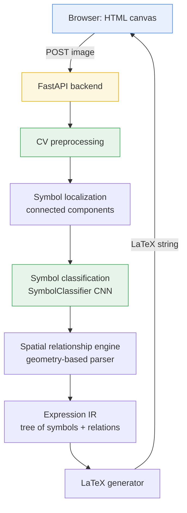
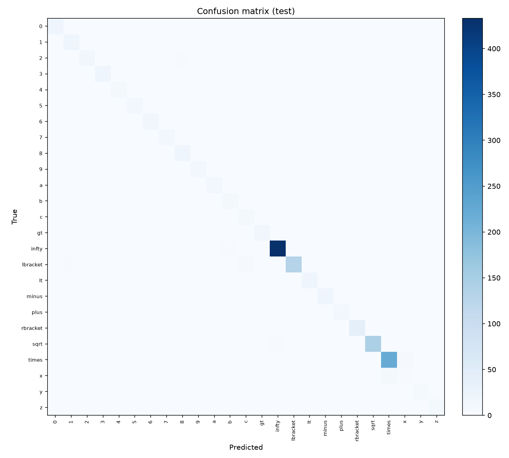

# LaTeXVision

Handwritten mathematical expression recognition: a browser canvas feeds a
computer-vision pipeline that turns handwritten math into structured LaTeX.

## Motivation

Recognizing handwritten math is not OCR. Reading `x² + y₁` requires
identifying six primitive glyphs (`x`, `2`, `+`, `y`, `1`, and an implicit
baseline) *and* inferring two structural facts that don't come from any
single glyph: the `2` is a superscript of `x`, and the `1` is a subscript of
`y`. A model that only classifies isolated characters never sees that
structure. LaTeXVision is built to make that separation explicit: symbol
recognition, spatial-relationship inference, and LaTeX generation are
independent, independently-testable stages rather than one opaque
end-to-end network.

The project is being built incrementally on purpose. Each phase below adds
one capability and is evaluated in isolation before the next one starts.

## Architecture



**Implemented today:** the full loop for a single symbol — `A`, `B`, `C`,
`E`, and back to `A`. A browser canvas posts a drawing to FastAPI, which
crops it to content (`C`), classifies it with `SymbolClassifier` (`E`), and
returns a prediction rendered back in the page. For a single already-known
symbol, its LaTeX is just a lookup in `class_mapping.json` — there's no
localization or relationship inference to do yet, so `D`, `F`, `G`, and `H`
are designed for but not yet built (they're only meaningful once an image
can contain more than one symbol) — see [Roadmap](#roadmap).

## Current capabilities

**Phase 1 — symbol classification:**
- Load and filter the HASYv2 handwritten-symbol dataset to a configurable
  25-class vocabulary.
- Train a small CNN (`SymbolClassifier`) to classify a single handwritten
  symbol from a 32x32 grayscale crop.
- Evaluate with accuracy, macro F1, per-class accuracy (with bootstrapped
  confidence intervals), and a confusion matrix.

**Phase 2 — browser interface:**
- A FastAPI backend (`src/api/main.py`) exposing `POST /recognize`: accepts
  a drawn-symbol image, crops it to content, classifies it, and returns the
  predicted symbol, its LaTeX, confidence, and the top-5 candidates.
- A canvas frontend (`frontend/`) — draw with mouse, trackpad, or touch,
  press Recognize, see the predicted symbol rendered via MathJax with a
  confidence bar and ranked alternatives.

- **Not yet implemented:** multi-symbol detection, spatial relationships,
  and LaTeX generation for full expressions (only a single symbol at a time
  is supported today). These are Phase 3+ (see [Roadmap](#roadmap)).

## Dataset

[HASYv2](https://doi.org/10.5281/zenodo.259444) (Thoma, 2017): 168,233
handwritten LaTeX symbols, 32x32 grayscale, 369 classes, collected via
[detexify](https://github.com/kirel/detexify) (users hand-drawing a symbol
to search for its LaTeX command name).

**Setup:**

```bash
mkdir -p data/raw/hasyv2_download
curl -L "https://zenodo.org/records/259444/files/HASYv2.tar.bz2?download=1" \
  -o data/raw/hasyv2_download/HASYv2.tar.bz2
tar -xjf data/raw/hasyv2_download/HASYv2.tar.bz2 -C data/raw/hasyv2_download/
```

This extracts `hasy-data/` (the PNGs) and `hasy-data-labels.csv`
(`path,symbol_id,latex,user_id`) into `data/raw/hasyv2_download/`. Licensed
under [ODbL v1.0](https://opendatacommons.org/licenses/odbl/1-0/); the
archive itself is not committed to this repository (see `.gitignore`).

**Vocabulary.** Phase 1 does not train on all 369 classes. The subset is
defined in [`configs/dataset.yaml`](configs/dataset.yaml):

| Group      | Symbols |
|------------|---------|
| Digits     | `0-9` |
| Variables  | `a b c x y z` |
| Operators  | `+ - × < >` |
| Grouping   | `[ ]` |
| Other      | `√ ∞` |

**`÷` was deliberately excluded**, not a data limitation like `=`/`(`/`)`
above. Mathematical notation essentially never uses the division-sign glyph
— division is written as a fraction, which belongs to the spatial-
relationship phases (numerator/denominator, Phase 4/5), not single-symbol
classification. It was also, in practice, the largest source of a real
misclassification bias under stroke-thickness variation — see
[`experiments/div_bias_investigation/`](experiments/div_bias_investigation/).

**Known dataset gap:** `=`, `(`, and `)` are absent from HASYv2 entirely.
Because the dataset comes from detexify lookups, nobody hand-draws a symbol
they can just type — so trivially-typable ASCII symbols were never
collected. This is a real constraint of the source data, not an oversight;
those three symbols will need to come from a different source (the Phase 6
synthetic generator, or another dataset) before the full pipeline can handle
expressions like `x = 1` or `(x + y)`.

The 25 selected classes total **8,413 images** with substantial class
imbalance (57 examples for `b` vs. 2,914 for `∞`, and just **66 total** for
`x` — 46 after splitting off val/test — vs. **1,509** for `\times`, since
detexify usage frequency varies a lot by symbol). `src/data/hasy.py`
produces a **stratified** train/val/test split (70/15/15) so every class is
represented proportionally in each split.

To counter that imbalance during training, `configs/classifier.yaml:
training.balance_strategy` defaults to `weighted_sampler`: a
`WeightedRandomSampler` oversamples minority classes so every class gets
roughly equal exposure per epoch, with augmentation providing a different
view each draw. This measurably outperformed the alternative
(`class_weights`, which reweights the loss but leaves sampling untouched) —
see [Evaluation](#evaluation) — because it gives rare classes more *distinct*
augmented examples per epoch rather than just a larger gradient on the same
handful of images.

## Model

`SymbolClassifier` ([`src/models/classifier.py`](src/models/classifier.py))
is an intentionally small CNN:

```
Conv(1→32) → BatchNorm → ReLU → MaxPool
Conv(32→64) → BatchNorm → ReLU → MaxPool
Conv(64→128) → BatchNorm → ReLU → AdaptiveAvgPool
Flatten → Dropout → Linear(128 → num_classes)
```

~96k parameters, ~390KB checkpoint. BatchNorm (`model.use_batchnorm` in
config, on by default) noticeably stabilizes training given how few examples
several classes have. The goal of Phase 1 is a reliable baseline and a
verified data pipeline, not architecture search — this is easy to swap out
once the rest of the pipeline exists.

## Training

```bash
python -m venv .venv && source .venv/bin/activate
pip install -r requirements.txt

python -m src.training.train_classifier
```

Config comes from [`configs/classifier.yaml`](configs/classifier.yaml); any
value can be overridden on the CLI, e.g.:

```bash
python -m src.training.train_classifier --epochs 50 --batch-size 32 --learning-rate 0.0005
```

For a fast pipeline sanity check without waiting on a full run:

```bash
python -m src.training.train_classifier --max-samples-per-class 20 --epochs 3 --run-name smoke_test
```

Training saves, per run, into `models/<run_name>/`:
`model.pt` (best-val-accuracy checkpoint), `class_mapping.json`
(class name ↔ index ↔ LaTeX label), `history.json` (per-epoch metrics),
`config.yaml` (resolved config used), `summary.json`, and the exact
`train_split.csv` / `val_split.csv` / `test_split.csv` used, so evaluation
is reproducible without re-deriving the split.

Runs on CPU, CUDA, or Apple Silicon MPS automatically (`training.device:
auto` in the config).

## Evaluation

```bash
python -m src.training.evaluate_classifier --run-dir models/symbol_classifier_v1
```

Produces `test_evaluation.json` (accuracy, macro F1, per-class accuracy with
a bootstrapped 95% confidence interval for each), `test_confusion_matrix.csv`,
and `test_confusion_matrix.png`. The CI matters here: several classes have
under 15 test examples, so a bare point estimate like "40% accuracy" is easy
to over-read when one flipped prediction swings it by 10 points —
`evaluate_classifier.py` reports the interval alongside every per-class
number instead of hiding that uncertainty.

**Current production model** (`models/symbol_classifier_v1`): **96.4% clean
test accuracy** (95% CI 95.3–97.4%), macro F1 0.896, weighted F1 0.964,
across 25 classes (1,262 test examples). A copy of this run's confusion
matrix and evaluation report is checked into
[`docs/results/`](docs/results/) for reference without needing to retrain.



This project is in a dedicated **Symbol Classification Optimization**
phase — a full audit-and-iterate campaign, tracked in
[`experiments/`](experiments/), not summarized in full here (see
`experiments/results.csv` for every run and `experiments/*/`for each
investigation's writeup). The two changes that mattered most:

1. **Fixed a real train/serve preprocessing mismatch.** Training/evaluation
   never applied the same content-cropping the deployed API always did —
   clean-test accuracy looked fine (96.4%) while the actual deployed
   pipeline scored ~40% on equivalent input. See
   [`experiments/audit/AUDIT_REPORT.md`](experiments/audit/AUDIT_REPORT.md).
   Fixing this is what today's 96.4% clean accuracy and a 97.25%-on-a-new-
   robustness-benchmark score both now have in common: they measure the
   pipeline that's actually deployed.
2. **Removed `÷` from the vocabulary.** Real mathematical notation uses
   fractions, not the division-sign glyph, and `÷` was also the largest
   source of a confirmed misclassification bias under stroke-thickness
   variation. See
   [`experiments/div_bias_investigation/FINDINGS.md`](experiments/div_bias_investigation/FINDINGS.md).

**Known, unresolved robustness gap:** the model still isn't robust to
stroke-thickness extremes — a synthetic "thinned strokes" test scores ~1.5%,
with almost every wrong prediction landing on `minus` (a single thin line is
the lowest-ink-density class in the vocabulary, and training augmentation
doesn't yet vary stroke width). A fix was attempted
(`RandomStrokeWidth` augmentation, `experiments/results.csv:
exp2_stroke_width_aug`) but regressed overall accuracy and was rejected;
left as an open problem rather than shipped half-working. See
[`src/evaluation/robustness.py`](src/evaluation/robustness.py) to reproduce
the full 11-condition benchmark, and
[`experiments/browser_handwriting/RESULTS.md`](experiments/browser_handwriting/RESULTS.md)
for a live test drawn through the actual browser interface (76.5% top-1 on
17 fresh symbols — read the methodology caveat there before citing that
number, it's depressed by a drawing-tool artifact, not purely a model
result).

**On `x` specifically:** still the weakest class (recall ~30-70% depending
on random seed, on only ~10 test examples — too little data to pin down
more precisely). Every seed's errors concentrate on the same thing: `x`↔`×`
confusion, confirmed again independently in the live browser test. This is
a genuine handwriting ambiguity, not a bug — a hastily-drawn `×` and `x`
often look identical in isolation, even to a human, without surrounding
context. Fixing it further needs disambiguating context (Phase 4's spatial
relationships: is this glyph sitting where an operator belongs between two
terms, or where a variable belongs?), not more single-symbol tuning.

## API

```bash
uvicorn src.api.main:app --reload --port 8000
```

Serves the frontend at `http://127.0.0.1:8000/` and the API alongside it.
By default it loads `models/symbol_classifier_v1`; override with the
`LATEXVISION_MODEL_DIR` environment variable to point at a different run.
If port 8000 is already taken by something else on your machine, pass a
different `--port` and open that port instead.

**Open the served URL, not the HTML file directly.** `frontend/index.html`
calls `fetch("/health")` and `fetch("/recognize")` as relative paths, which
only resolve correctly when the page is loaded from the running server
(`http://127.0.0.1:8000/...`). Opening `frontend/index.html` straight from
disk (a `file://...` URL) will fail every request with "Could not reach the
backend: Failed to fetch" even if the server is running fine — that error
means the page's origin is wrong, not that the backend is down.

- `GET /health` → `{"status": "ok", "model_loaded": bool}`
- `POST /recognize` — multipart form field `file`: a symbol image (e.g. a
  canvas PNG export, typically RGBA with a transparent background, which is
  flattened onto white before classification). The image is cropped to its
  drawn content (`src/data/preprocessing.py:crop_to_content`) before
  classification, since a raw canvas drawing has very different scale/
  framing than HASYv2's tightly-cropped training images. Returns:
  ```json
  {
    "symbol": "x", "latex": "x", "confidence": 0.94,
    "top_k": [{"symbol": "x", "latex": "x", "confidence": 0.94}, "..."]
  }
  ```
  `400` if the canvas has no content; `503` if no trained model is loaded.

## Frontend

Static HTML/CSS/JS at `frontend/` (canvas + "Recognize"/"Clear", served by
the FastAPI backend above — no separate build step or server). Drawing uses
the Pointer Events API so mouse, trackpad, and touch all work through the
same handlers. The predicted symbol is rendered via MathJax (loaded from a
CDN) so LaTeX commands like `\times` or `\infty` show as their actual glyph,
not the raw string; a confidence bar and the top-5 ranked alternatives are
shown alongside it for a fuller view of the model's output, not just the
single top prediction.

## Roadmap

- [x] **Phase 1 — Symbol classification baseline:** HASYv2 loader,
      preprocessing/augmentation, CNN classifier, training, evaluation, tests.
- [x] **Phase 2 — Browser interface:** canvas → FastAPI → single-symbol
      prediction → rendered result.
- [ ] **Phase 3 — Symbol localization:** connected-component / contour
      detection to find multiple symbol regions in one image, each cropped
      and classified independently.
- [ ] **Phase 4 — Spatial relationship engine:** deterministic,
      config-driven geometry rules (bounding boxes, size ratios, vertical/
      horizontal displacement) to infer `SUPERSCRIPT`, `SUBSCRIPT`,
      `RIGHT_OF`, `NUMERATOR_OF`, etc.
- [ ] **Phase 5 — Expression representation:** an intermediate tree
      structure (base/superscript/subscript/operators) decoupled from LaTeX
      string generation.
- [ ] **Phase 6 — Synthetic multi-symbol dataset:** a controlled grammar
      generator with full ground truth (image, LaTeX, symbol boxes,
      relationships, IR) for development and evaluation — and the eventual
      source for `=`, `(`, `)`, which HASYv2 lacks.
- [ ] **Phase 7 — CROHME integration:** evaluation against real handwritten
      multi-symbol expressions.
- [ ] **Docker:** containerize the FastAPI service once it exists.

## Project structure

```
latexvision/
├── .github/workflows/     # ci.yml (pytest on push/PR)
├── configs/              # dataset.yaml, classifier.yaml
├── data/                 # raw/processed/synthetic (gitignored, see README)
├── docs/results/          # checked-in copy of the current baseline's eval report + confusion matrix
├── models/               # trained checkpoints + eval artifacts (gitignored)
├── src/
│   ├── data/              # hasy.py, preprocessing.py
│   ├── models/            # classifier.py
│   ├── training/          # train_classifier.py, evaluate_classifier.py
│   ├── recognition/        # Phase 3+ (not yet implemented)
│   └── api/                # main.py, inference.py
├── frontend/              # index.html, styles.css, app.js
└── tests/                 # test_classifier.py, test_data.py, test_evaluate.py, test_api.py
```

## Testing

```bash
pytest
```

20 tests covering the dataset loader (class filtering, stratified splitting,
tensor shapes, content-cropping), the classifier (output shape, determinism,
gradient flow), evaluation (bootstrap confidence interval sanity checks),
the API (health check, frontend served, blank-canvas rejection, a real
prediction end-to-end via FastAPI's `TestClient`), and a regression test
asserting the training dataset path and the deployed inference path produce
the same prediction for the same image (guards against the exact bug in
`experiments/audit/AUDIT_REPORT.md`, Finding 1, recurring). Tests that
require the downloaded HASYv2 data or a trained checkpoint are skipped
automatically
if either isn't present -- this is also what CI runs, without fetching the
dataset (see `.github/workflows/ci.yml`).
